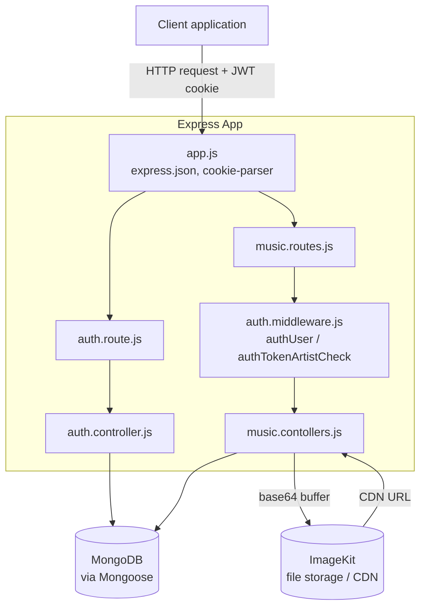
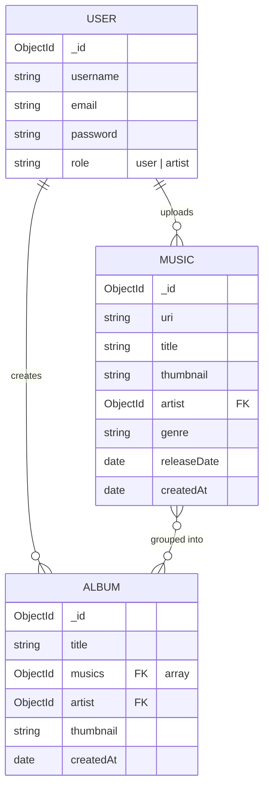
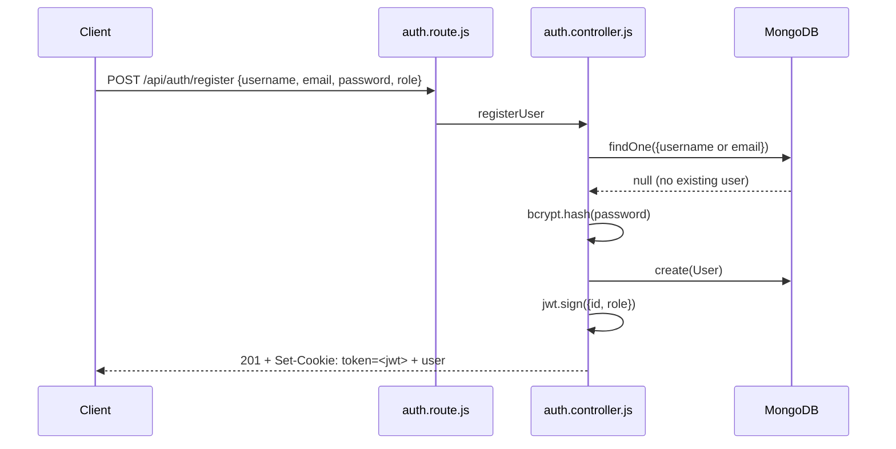
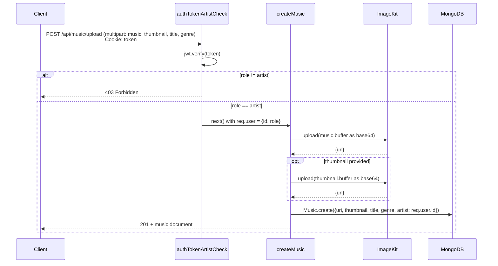

# Audiora

A REST API backend for a music-streaming platform. Listeners can browse tracks
and albums; artists can upload tracks, group them into albums, and attach
cover art. Built on Express 5 and MongoDB, with file storage delegated to
ImageKit.

## Table of Contents

- [What it does](#what-it-does)
- [Why it's useful](#why-its-useful)
- [Architecture](#architecture)
- [Data model](#data-model)
- [Request flows](#request-flows)
- [API reference](#api-reference)
- [Getting started](#getting-started)
- [Project structure](#project-structure)
- [Roadmap](#roadmap)
- [Getting help](#getting-help)
- [Maintainers and contributing](#maintainers-and-contributing)
- [License](#license)

## What it does

Audiora exposes a small, role-aware API for a Spotify-style catalog:

- **Accounts** — register and log in as a `user` (listener) or `artist`,
  authenticated via a JWT stored in an HTTP cookie.
- **Catalog** — any authenticated account can list every track and album in
  the system, look up a single track or album by id, or list every track
  from a given artist.
- **Publishing** — artist accounts can upload a track (audio file plus an
  optional cover image) and bundle their tracks into albums.

Audio and image files never touch the local filesystem: uploads are streamed
into memory by Multer, base64-encoded, and handed off to ImageKit, which
returns a CDN URL that gets stored on the document.

## Why it's useful

- **Role-based access baked into the schema and middleware** — listener and
  artist accounts share one `User` model, differentiated by a `role`
  enum, with dedicated middleware (`authUser`, `authTokenArtistCheck`)
  guarding read vs. write routes.
- **Stateless, cookie-based auth** — no server-side session store; a signed
  JWT carries `id` and `role`, decoded per request.
- **Storage-agnostic uploads** — `storage.service.js` wraps ImageKit behind a
  single `filesUpload(buffer, { fileName, folder })` function, so swapping
  providers means touching one file.
- **Populated, ready-to-render responses** — catalog endpoints populate the
  `artist` reference so consumers get a username without a second round
  trip.

## Architecture

Layered Express application: routes validate nothing themselves and delegate
straight to middleware and controllers; controllers are the only layer that
talks to Mongoose models or the storage service.



`server.js` is the process entry point: it loads environment variables,
opens the MongoDB connection (`db.js`), and starts the HTTP listener.
`app.js` is the Express instance itself, kept separate so it can be imported
directly in tests without binding a port.

## Data model

Three collections. `Music.artist` and `Album.artist` both reference `User`;
`Album.musics` references individual tracks.



`password` is stored as a bcrypt hash, never plaintext. `uri` and
`thumbnail` on `Music`, and `thumbnail` on `Album`, are ImageKit CDN URLs,
not local paths.

## Request flows

### Registration and login

Both issue the same kind of token; the only difference is whether a new
`User` document is created first.



Login follows the same shape, replacing `create` with a
`findOne` + `bcrypt.compare` check against the stored hash.

### Uploading a track (artist only)



Creating an album (`POST /api/music/album`) follows the same
artist-gated pattern: an optional single `thumbnail` file is uploaded, the
`musics` field (one or more track IDs) is normalized into an array, and the
resulting `Album` document is created and returned.

## API reference

All routes are mounted under `/api`. Authenticated routes expect the `token`
cookie set by register/login. This is a summary — see the route and
controller source under `src/` for exact request/response shapes.

| Method | Endpoint            | Auth              | Description                                   |
| ------ | -------------------- | ----------------- | ---------------------------------------------- |
| POST   | `/auth/register`     | Public             | Create an account (`role` defaults to `user`)  |
| POST   | `/auth/login`         | Public             | Log in, sets the `token` cookie                |
| GET    | `/music`              | Any logged-in user | List every track, artist populated             |
| GET    | `/music/:id`          | Any logged-in user | Get a single track by id                       |
| GET    | `/music/artist/:id`   | Any logged-in user | List every track by a given artist             |
| GET    | `/music/album`        | Any logged-in user | List every album, artist populated             |
| GET    | `/albums/:id`         | Any logged-in user | Get a single album by id                       |
| POST   | `/music/upload`       | Artist only        | Upload a track (`music`, optional `thumbnail`) |
| POST   | `/music/album`        | Artist only        | Create an album (`title`, `musics`, optional `thumbnail`) |

> Note: `/albums/:id` doesn't share the `/music` prefix used by every other
> catalog route (`/music/album` for the list, `/albums/:id` for a single
> one). If that's intentional because it's mounted as its own router, ignore
> this; if not, consider renaming it to `/music/album/:id` for consistency.

## Getting started

### Prerequisites

- Node.js 18+
- A MongoDB instance (local or Atlas)
- An ImageKit account and private key

### Installation

```bash
git clone <this-repository>
cd audiora
npm install
```

Create a `.env` file in the project root:

```env
PORT=3000
MONGO_URI=mongodb://localhost:27017/audiora
JWT_SECRET=replace-with-a-long-random-string
IMAGE_KIT_PRIVATE_KEY=your-imagekit-private-key
```

Run it:

```bash
npm run dev    # nodemon, auto-restarts on change
npm start      # plain node, for production
```

### Usage examples

Register an artist account:

```bash
curl -X POST http://localhost:3000/api/auth/register \
  -H "Content-Type: application/json" \
  -d '{"username":"nova","email":"nova@example.com","password":"secret123","role":"artist"}' \
  -c cookies.txt
```

Upload a track (reuses the cookie jar from registration/login):

```bash
curl -X POST http://localhost:3000/api/music/upload \
  -b cookies.txt \
  -F "title=Night Drive" \
  -F "genre=Synthwave" \
  -F "music=@./night-drive.mp3" \
  -F "thumbnail=@./cover.jpg"
```

Browse the catalog:

```bash
curl http://localhost:3000/api/music -b cookies.txt
```

Fetch a single track, a given artist's tracks, or a single album:

```bash
curl http://localhost:3000/api/music/<track-id> -b cookies.txt
curl http://localhost:3000/api/music/artist/<artist-id> -b cookies.txt
curl http://localhost:3000/api/albums/<album-id> -b cookies.txt
```

## Project structure

```
audiora/
├── server.js                    # entry point: env, DB connect, listen
├── src/
│   ├── app.js                   # Express app: middleware + route mounting
│   ├── db/
│   │   └── db.js                # Mongoose connection
│   ├── models/
│   │   ├── user.model.js
│   │   ├── music.model.js
│   │   └── album.model.js
│   ├── routes/
│   │   ├── auth.route.js
│   │   └── music.routes.js
│   ├── middlewares/
│   │   └── auth.middleware.js   # authUser, authTokenArtistCheck
│   ├── controllers/
│   │   ├── auth.controller.js
│   │   └── music.contollers.js
│   └── services/
│       └── storage.service.js   # ImageKit upload wrapper
└── package.json
```

## Roadmap

Known gaps, in rough priority order:

- No CORS middleware — a frontend on a different origin will need one added,
  or a dev-server proxy in the meantime.
- No `GET /auth/me` or `POST /auth/logout` — clients currently have to
  remember the user object from register/login themselves and clear the
  cookie client-side to log out.
- `Album.musics` references a model named `musics`; confirm this matches
  whatever name `Music` is registered under (`mongoose.model(name, ...)`)
  before relying on `.populate("musics")` — otherwise population will
  silently return unresolved ObjectIds.

## Getting help

Open an issue in this repository for bugs or questions. For usage questions
not covered here, check the controller and route source under `src/` — the
codebase is small enough to read end to end.

## Maintainers and contributing

See [`CONTRIBUTING.md`](CONTRIBUTING.md) for how to propose changes. Issues
and pull requests are welcome.

## License

See [`LICENSE`](LICENSE) for details.
